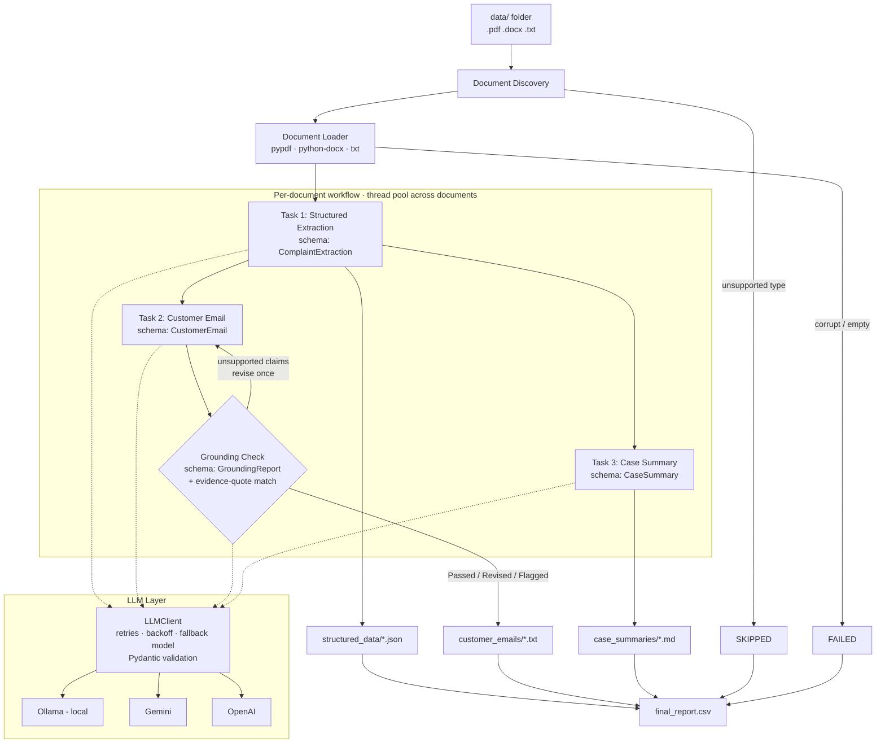

# AI Customer Complaint & Case Processing System

**IIT Patna × USDC GenAI Development Program - Final Evaluation, Project 1**
*AI-Powered Document Processing & Business Workflow*

A batch GenAI workflow that reads customer complaint documents (PDF, DOCX, TXT) from a local folder and, for each document, runs three LLM tasks: **structured information extraction** (validated with Pydantic), **customer reply email generation** (with an automatic **grounding check** that catches and removes invented facts) and **internal management case summary**. Everything is consolidated into a CSV report.

Runs fully **locally with Ollama**. No API key or paid service is needed. It can also run on Google Gemini or OpenAI by changing one line in `.env`.

---

## 1. Problem Statement

Support teams receive complaints in many formats: emailed text, scanned-and-exported PDFs, formal Word letters. For every case an agent must:

1. read the document and record the key facts in the CRM,
2. write a professional reply to the customer, and
3. brief management on the case and the next step.

Doing this by hand is slow and inconsistent, and fields are often missed. This project automates the whole flow while keeping every output **grounded in the source document**.

## 2. Solution Overview

| Step | What happens | Output |
|---|---|---|
| **Ingestion** | Discover files in `data/`, extract text from `.pdf` / `.docx` / `.txt`, and skip unsupported or corrupt files gracefully | text |
| **Task 1: Extraction** | LLM → JSON constrained by a Pydantic schema → validated `ComplaintExtraction` | `output/structured_data/*.json` |
| **Task 2: Customer email** | Document + extracted data → validated `CustomerEmail` (subject, body) | `output/customer_emails/*.txt` |
| **Task 2b: Grounding check** | Verifier LLM lists each claim in the email with an evidence quote; code confirms each quote exists in the source. If anything is unsupported, the email is regenerated with that feedback and re-checked | `X-Grounding-Check` header + CSV columns |
| **Task 3: Case summary** | Document + extracted data → validated `CaseSummary` | `output/case_summaries/*.md` |
| **Report** | One row per input file, including failures and skips | `output/final_report.csv` |

Tasks 2 and 3 depend on Task 1 but not on each other, so they **run in parallel**. Several documents are also processed in parallel (`MAX_WORKERS`).

## 3. Architecture



The same diagram is in [`docs/architecture.md`](docs/architecture.md).

### How a structured LLM call works

```
prompt + JSON schema ──► provider (schema-constrained decoding)
                               │
                        raw JSON text
                               │
            strip code fences → Pydantic model_validate_json
                 │                               │
              valid ✔                  invalid / 429 / 503 / timeout
                 │                               │
           typed object           retry with exponential backoff (tenacity)
                                                 │
                              still failing → fallback model (if configured)
                                                 │
                                      still failing → LLMError
```

### How the email grounding check works

Small local models sometimes "helpfully" invent company policy, for example *"we do not offer extended warranties after purchase"* when the customer only asked a question. A prompt instruction alone did not reliably stop this with `qwen2.5:7b`, so the email task is a **generate → verify → revise** loop:

1. **Generate** the email draft.
2. **Verify**: a second LLM call returns a `GroundingReport` listing every factual claim in the draft, each with an `evidence_quote` copied from the source document.
3. **Deterministic checks in code** (`src/schemas.py`), which guard against mistakes by the small verifier model:
   - **Evidence check**: a claim counts as supported only if the LLM marked it supported **and** at least 80% of its quote's words occur in the source document. This catches a verifier that "quotes" the email instead of the source, while tolerating small paraphrases.
   - **Claim-origin check**: a "claim" is only considered if at least 60% of its words occur in the email. During development, `qwen2.5:7b` sometimes listed sentences from the *complaint document* as claims, which caused false alarms.
4. If any claim is unsupported, the email is **regenerated once** with the rejected statements as feedback, then re-verified.
5. The result is recorded as `Passed`, `Revised` or `Flagged`. Flagged emails get an `X-Review-Required` header listing the problem statements, for a human to review.

Real example from development (`complaint_005`, an extended-warranty question):

| Claim in first draft | Evidence quote | Verdict |
|---|---|---|
| "The standard warranty is one year" | `The standard warranty is one year.` | ✅ supported |
| "We do not offer the option to purchase an extended warranty" | *(none)* | ❌ invented |
| "Our standard warranty includes the compressor" | `which includes the compressor.` (from the *email*, not the document) | ❌ caught by the evidence check |

Disable with `EMAIL_GROUNDING_CHECK=false` for faster runs.

## 4. Technology Stack

| Area | Technology |
|---|---|
| Language | Python 3.11+ (developed on 3.13) |
| LLM (default) | [Ollama](https://ollama.com) running `qwen2.5:7b` locally |
| LLM (optional) | Google Gemini (`google-genai`), OpenAI (`openai`) |
| Structured outputs | Pydantic v2 + provider JSON-schema mode |
| Document parsing | `pypdf`, `python-docx` |
| Concurrency | `concurrent.futures.ThreadPoolExecutor` |
| Resilience | `tenacity` (retry + exponential backoff) |
| Config | `python-dotenv` (`.env`) |
| Logging | `logging` (console + rotating file `logs/app.log`) |
| Tests | `pytest` (fake LLM, no network needed) |

## 5. Project Structure

```
ai-complaint-processor/
├── main.py                      # CLI entry point
├── requirements.txt
├── requirements-dev.txt         # + reportlab, to regenerate sample PDFs
├── .env.example                 # copy to .env
├── data/                        # sample input documents
├── output/                      # sample outputs from a real run
│   ├── structured_data/
│   ├── customer_emails/
│   ├── case_summaries/
│   └── final_report.csv
├── docs/architecture.md
├── scripts/generate_sample_data.py
├── src/
│   ├── config.py                # settings from environment, with validation
│   ├── logger.py                # logging setup
│   ├── schemas.py               # Pydantic models for all 3 LLM outputs
│   ├── prompts.py               # prompt templates + grounding rules
│   ├── workflow.py              # orchestration (sequential + parallel)
│   ├── ingestion/
│   │   └── document_loader.py   # discover + read txt/pdf/docx
│   ├── llm/
│   │   ├── base.py              # LLMClient: retries, fallback, validation
│   │   ├── gemini_client.py
│   │   ├── openai_client.py     # OpenAI + Ollama (OpenAI-compatible API)
│   │   └── factory.py
│   ├── tasks/
│   │   ├── extraction.py        # Task 1
│   │   ├── email_generator.py   # Task 2
│   │   ├── grounding_check.py   # Task 2b: verifier for the email
│   │   └── case_summary.py      # Task 3
│   └── output/
│       └── writers.py           # JSON / TXT / MD / CSV writers
└── tests/
    ├── test_document_loader.py
    └── test_workflow.py
```

## 6. Setup

### Prerequisites
- Python 3.11 or newer
- **Ollama** (default, free, local): install from <https://ollama.com/download>, then:
  ```bash
  ollama pull qwen2.5:7b      # ~4.7 GB, runs well on 16 GB RAM
  ```
  (The Ollama desktop app starts the server automatically. Otherwise run `ollama serve`.)

### Install
```bash
git clone <repo-url> ai-complaint-processor
cd ai-complaint-processor

python3 -m venv .venv
source .venv/bin/activate          # Windows: .venv\Scripts\activate
pip install -r requirements.txt

cp .env.example .env               # defaults already point to local Ollama
```

## 7. Environment Variables

| Variable | Default | Description |
|---|---|---|
| `LLM_PROVIDER` | `ollama` | `ollama`, `gemini` or `openai` |
| `LLM_MODEL` | `qwen2.5:7b` | Primary model name |
| `LLM_FALLBACK_MODEL` | *(empty)* | Model used if the primary keeps failing with 429/503/timeouts |
| `LLM_TEMPERATURE` | `0.2` | Low for consistent extraction |
| `LLM_MAX_RETRIES` | `4` | Attempts per model per task |
| `GEMINI_API_KEY` | | Required only for `gemini` |
| `OPENAI_API_KEY` | | Required only for `openai` |
| `OLLAMA_BASE_URL` | `http://localhost:11434/v1` | Ollama OpenAI-compatible endpoint |
| `DATA_DIR` | `data` | Input folder |
| `OUTPUT_DIR` | `output` | Output folder |
| `MAX_WORKERS` | `1` | Documents processed concurrently. Keep `1` for Ollama; use 2–4 for Gemini/OpenAI |
| `EMAIL_GROUNDING_CHECK` | `true` | Verify emails against the source and revise if needed |
| `LOG_LEVEL` | `INFO` | `DEBUG`, `INFO`, `WARNING`… |

**Switching to Gemini** (free tier works):
```env
LLM_PROVIDER=gemini
LLM_MODEL=gemini-flash-latest
LLM_FALLBACK_MODEL=gemini-flash-lite-latest
GEMINI_API_KEY=<your key from https://aistudio.google.com/apikey>
```

> `.env` is git-ignored. Never commit API keys.

## 8. How to Run

```bash
python main.py                                    # process data/ → output/
python main.py --data-dir my_docs --output-dir results --workers 3
python -m pytest -q                               # run unit tests (no LLM needed)
python scripts/generate_sample_data.py            # regenerate sample docs (needs requirements-dev.txt)
```

Exit code is `0` if at least one document was processed, and `1` if nothing could be processed or the configuration is invalid. Individual file failures are listed in the summary and in `final_report.csv`.

## 9. Sample Inputs

`data/` contains 8 files that together cover the main scenarios and the error paths:

| File | Format | Scenario |
|---|---|---|
| `complaint_001.pdf` | PDF | Defective washing machine, failed repair, threatens consumer forum → **escalation** |
| `complaint_002.txt` | TXT | Double broadband charge, already refunded → **resolved** |
| `complaint_003.docx` | DOCX (with table) | Delayed laptop delivery, courier query raised → **in progress** |
| `complaint_004.pdf` | PDF | Mobile app login failure, **no phone number** given |
| `complaint_005.txt` | TXT | Extended-warranty question → **not a complaint** |
| `complaint_006.docx` | DOCX | Refund pending 4 weeks, 3 follow-ups, asks for manager → **escalation** |
| `complaint_007_corrupt.pdf` | PDF | Corrupt file → handled as **FAILED**, batch continues |
| `complaint_008.xlsx` | XLSX | Unsupported format → **SKIPPED** |

All names, companies, emails and phone numbers are fictional.

## 10. Sample Outputs

The `output/` folder in this repository contains the **real output of a full run** with `LLM_PROVIDER=ollama` and `qwen2.5:7b` on a 16 GB Apple M3 (about 23 minutes for the batch).

### Console summary
```
================================================================
Processed 8 file(s) in 1388.6s
  SUCCESS  6
  PARTIAL  0
  FAILED   1
  SKIPPED  1
Outputs: .../ai-complaint-processor/output
================================================================
  ! complaint_007_corrupt.pdf: Load error: Corrupt or unreadable PDF 'complaint_007_corrupt.pdf': Stream has ended unexpectedly
  ! complaint_008.xlsx: Unsupported file type '.xlsx'
```

### `final_report.csv` (selected columns)
| File | Status | Category | Complaint | Escalation | Evidence | Case status | Priority | Email grounding |
|---|---|---|---|---|---|---|---|---|
| `complaint_001.pdf` | SUCCESS | Technical Issue | Yes | Yes | Yes | Open | High | Passed |
| `complaint_002.txt` | SUCCESS | Billing & Payment | No | No | No | Resolved | Low | Revised |
| `complaint_003.docx` | SUCCESS | Delivery & Shipping | Yes | Yes | No | In Progress | High | Flagged |
| `complaint_004.pdf` | SUCCESS | Account & Access | Yes | No | Yes | Open | Medium | Revised |
| `complaint_005.txt` | SUCCESS | General Inquiry | No | No | No | Open | Low | Revised |
| `complaint_006.docx` | SUCCESS | Refund & Return | Yes | Yes | Yes | Open | High | Revised |
| `complaint_007_corrupt.pdf` | FAILED | - | - | - | - | - | - | - |
| `complaint_008.xlsx` | SKIPPED | - | - | - | - | - | - | - |

### Structured extraction: `structured_data/complaint_006.json`
```json
{
  "source_file": "complaint_006.docx",
  "processed_at": "2026-09-17T17:18:53",
  "data": {
    "customer_name": "Kavya Nair",
    "email": "kavya.nair@example.com",
    "phone_number": "+91 94470 67890",
    "product_or_service": "running shoes (Order ST-39021, amount Rs. 4,499)",
    "complaint_category": "Refund & Return",
    "issue_description": "Customer returned a pair of running shoes due to incorrect size, but has not received the refund within the promised 7 working days.",
    "resolution_provided": null,
    "is_complaint": "Yes",
    "escalation_required": "Yes",
    "supporting_document_available": "Yes",
    "overall_case_status": "Open"
  }
}
```

### Customer email: `customer_emails/complaint_004.txt`
The first draft claimed the team had "reviewed the attached screenshots" and was "currently investigating". Neither is stated in the ticket, so the grounding check rejected the draft and this revised version was produced:
```
To: ananya.reddy@example.com
Subject: Re: Issue with PayWise Mobile App Login
X-Grounding-Check: Revised

Dear Ananya Reddy,

Thank you for reaching out to us regarding your issue with the PayWise Mobile App. We understand that you are experiencing difficulties logging in after the app update on 11 September 2026. The app is showing 'Session expired, please try again' after you enter the OTP, and you have tried reinstalling the app and using both mobile data and WiFi without success.

We appreciate your patience and are currently reviewing your case. Our team will thoroughly examine the issue and provide you with a resolution as soon as possible.

Warm regards,
Customer Support Team
```

### Case summary: `case_summaries/complaint_006.md`
```markdown
# Case Summary - complaint_006

| Field | Value |
|---|---|
| Source file | complaint_006.docx |
| Customer | Kavya Nair |
| Category | Refund & Return |
| Escalation required | Yes |
| Priority | High |

## Case Overview
Kavya Nair returned running shoes due to incorrect size and has not received the refund within the promised 7 working days. She has followed up multiple times without resolution.

## Key Issue
Customer has not received refund despite multiple follow-ups and return confirmation.

## Action Taken
Customer has followed up via email, phone, and chat. Screenshots and chat transcripts are attached.

## Current Status
Refund not processed after 4 weeks, case is still open.

## Recommended Next Action
Escalate the case to a manager and request a specific timeline for refund processing.
```

### Grounding check results in this run
- **Passed** (1): the first draft had no unsupported claims.
- **Revised** (4): unsupported statements were detected and removed by regeneration. Examples of rejected statements: *"improving our billing processes to prevent such issues"* (002), *"we do offer extended warranties for our products"* (005).
- **Flagged** (1, `complaint_003`): kept for human review. In this case it is a **false positive**, because the job start date *is* in the complaint. This illustrates the verifier limitation described below.

## 11. Key Design Decisions

1. **Three separate LLM calls instead of one big prompt.** Each task has a focused prompt and its own schema, which gives more reliable output. One task can fail without losing the others (a `PARTIAL` status), and each step can be tested on its own.
2. **Extraction first, then email and summary in parallel.** The email and summary both need the extracted facts, but not each other. Running them concurrently cuts wall-clock time per document. Documents are also parallelised with a bounded thread pool, so a free-tier API or a local GPU isn't overloaded.
3. **The source document is passed to Tasks 2 and 3 as well as the extracted JSON.** Extraction deliberately compresses information, so giving the generators the original text avoids losing detail. Shared grounding rules in `prompts.py` forbid inventing facts.
4. **Validation on two levels.** The provider's JSON-schema mode constrains decoding, and `pydantic.model_validate_json` then enforces types, enums (`Yes`/`No`, category, status) and custom validators (such as dropping malformed emails). Raw LLM text is never saved.
5. **Grounding is verified, not just requested.** Emails pass through an LLM verifier plus a deterministic evidence-quote check, and are revised or flagged automatically (see *How the email grounding check works*).
6. **Invalid output counts as a retryable error.** Small local models sometimes emit malformed JSON, and a retry usually fixes it.
7. **A provider-agnostic `LLMClient` abstraction.** Retry, backoff, fallback and validation live in one base class, and each provider only implements `_complete_json`. Ollama reuses the OpenAI client through its OpenAI-compatible endpoint.
8. **Local-first by default.** Ollama means no cost, no data leaves the machine (important for customer PII), and the evaluator can run it without an API key.
9. **Failures are data, not crashes.** Every input file gets a row in `final_report.csv` with status `SUCCESS` / `PARTIAL` / `FAILED` / `SKIPPED` and the error reason.

## 12. Limitations

- **Scanned (image-only) PDFs** yield no text. OCR (e.g. Tesseract) isn't included, so such files are reported as `FAILED` with "no usable text".
- **Local 7B models are less accurate** than large hosted models on subtle judgements (e.g. whether escalation is needed, or the category *Product Defect* vs *Technical Issue*). Gemini/OpenAI can be swapped in via `.env`.
- **Local inference is slow on modest hardware.** On a 16 GB Apple M3 with other apps open, `qwen2.5:7b` generated about 5–6 tokens/s, so a document takes about 2–4 minutes with the grounding check. The same batch on Gemini took under 2 minutes in total. Ollama serves one request at a time by default, so `MAX_WORKERS=1` avoids queue timeouts.
- **The grounding verifier is itself an LLM, and with a 7B model it is inconsistent in both directions.** It sometimes flags a true statement (a harmless rewrite, or a false "Flagged"), and it sometimes misses one. In the sample run, the revised `complaint_006` email still says it "will escalate this matter to a manager", a commitment not in the document. The code checks reduce these errors but cannot remove them, so emails should be reviewed by a person before sending. A stronger model (Gemini/OpenAI) makes fewer mistakes, both when generating and when checking.
- **Extraction mistakes with the local model**: in the sample run `qwen2.5:7b` left `resolution_provided` empty for `complaint_001`, although a technician visit is described, and chose *Technical Issue* over *Product Defect*. The Gemini run extracted both correctly.
- **One document is treated as one case.** A file containing several unrelated complaints is summarised as a single case.
- **Very long documents** are sent whole. There's no chunking, so documents beyond the model's context window would be truncated by the provider.
- The **case summary is not grounding-checked** (only the customer-facing email is), because its `recommended_next_action` is intentionally a recommendation rather than a fact.
- The emails are **drafts for human review**. Nothing is actually sent.
- No database or UI. Outputs are files, by design for a batch workflow.
