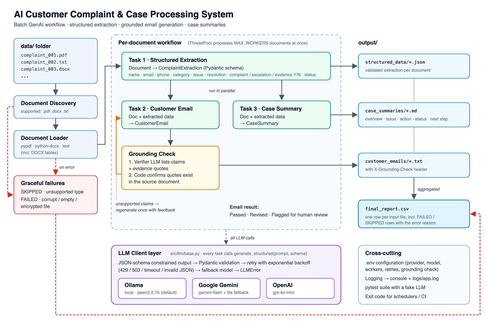
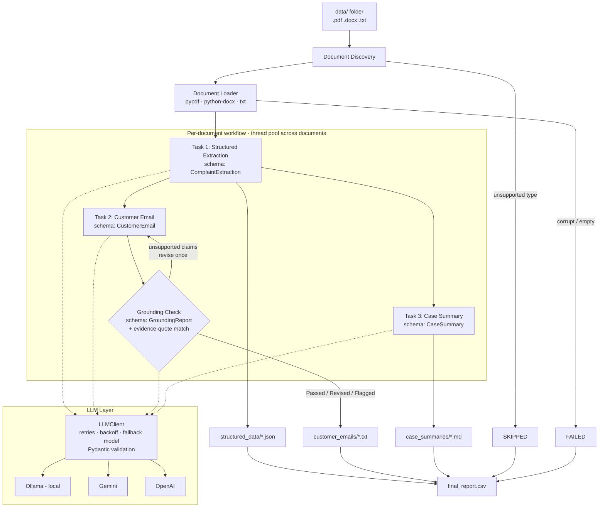

# Architecture

## Mermaid version

```mermaid
flowchart TD
    A[data/ folder<br/>.pdf .docx .txt] --> B[Document Discovery]
    B -->|unsupported type| S[SKIPPED]
    B --> C[Document Loader<br/>pypdf · python-docx · txt]
    C -->|corrupt / empty| F[FAILED]
    C --> D

    subgraph W[Per-document workflow · thread pool across documents]
        D[Task 1: Structured Extraction<br/>schema: ComplaintExtraction]
        D --> E1[Task 2: Customer Email<br/>schema: CustomerEmail]
        E1 --> G{Grounding Check<br/>schema: GroundingReport<br/>+ evidence-quote match}
        G -->|unsupported claims<br/>revise once| E1
        D --> E2[Task 3: Case Summary<br/>schema: CaseSummary]
    end

    subgraph L[LLM Layer]
        LC[LLMClient<br/>retries · backoff · fallback model<br/>Pydantic validation]
        LC --> P1[Ollama - local]
        LC --> P2[Gemini]
        LC --> P3[OpenAI]
    end

    D -.-> LC
    E1 -.-> LC
    G -.-> LC
    E2 -.-> LC

    D --> O1[structured_data/*.json]
    G -->|Passed / Revised / Flagged| O2[customer_emails/*.txt]
    E2 --> O3[case_summaries/*.md]
    O1 & O2 & O3 & S & F --> R[final_report.csv]
```

See the main README for a description of each component and the key design decisions.
